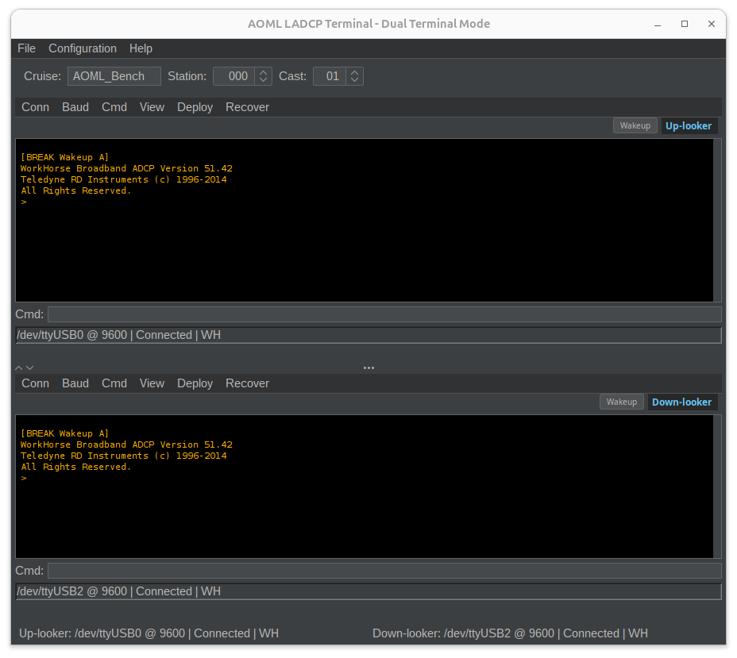
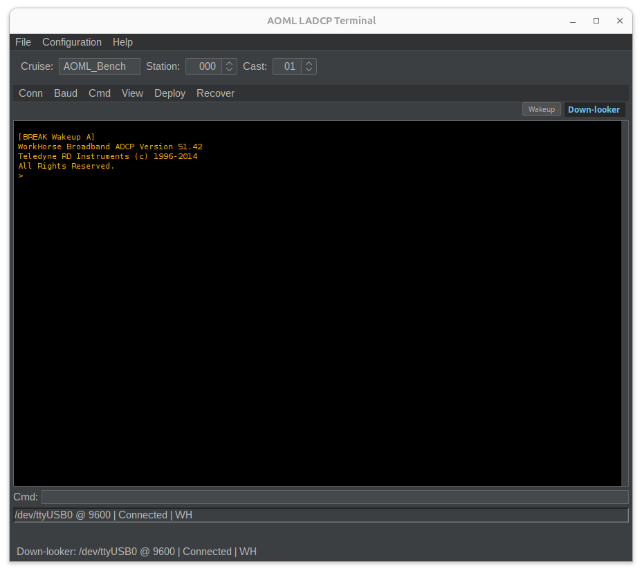
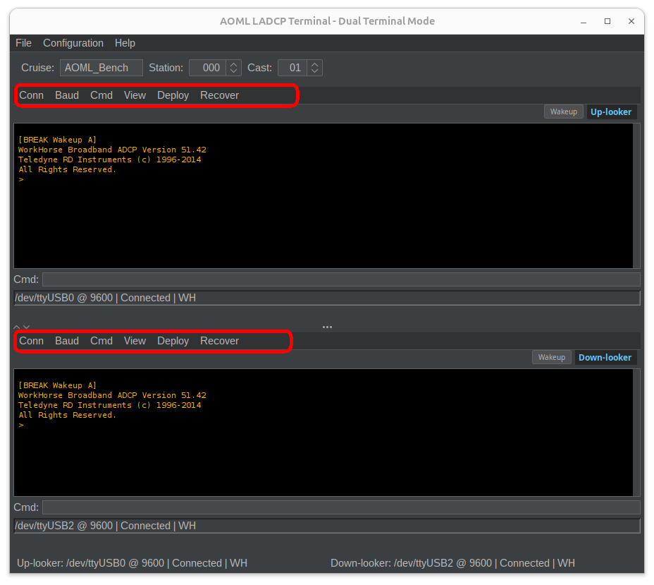
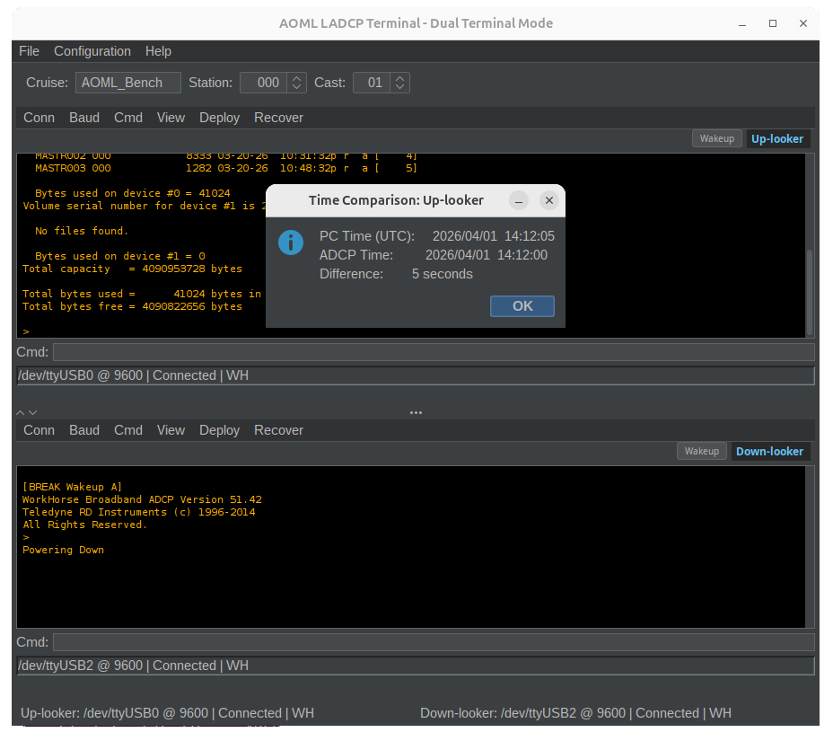
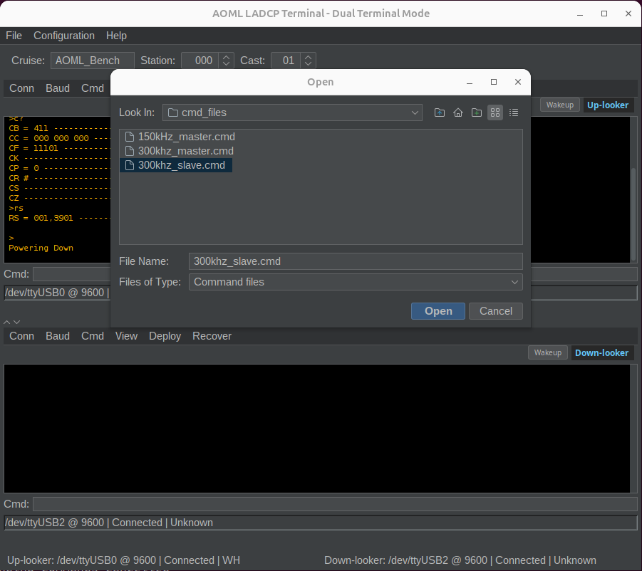

Disclaimer
==========
This repository is a scientific product and is not official communication of the National Oceanic and
Atmospheric Administration, or the United States Department of Commerce. All NOAA GitHub project code is
provided on an 'as is' basis and the user assumes responsibility for its use. Any claims against the Department of
Commerce or Department of Commerce bureaus stemming from the use of this GitHub project will be governed
by all applicable Federal law. Any reference to specific commercial products, processes, or services by service
mark, trademark, manufacturer, or otherwise, does not constitute or imply their endorsement, recommendation or
favoring by the Department of Commerce. The Department of Commerce seal and logo, or the seal and logo of a
DOC bureau, shall not be used in any manner to imply endorsement of any commercial product or activity by
DOC or the United States Government.

# AOML LADCP Terminal

A cross-platform Java terminal application for controlling and communicating with RDI (Teledyne) ADCP instruments used in Lowered Acoustic Doppler Current Profiler (LADCP) oceanographic operations.

This is a Java port of the original Python [UHDAS LADCP Terminal](https://currents.soest.hawaii.edu/git/uh-currents-group/shipboard-adcp/uhdas) developed by the University of Hawaii for oceanographic research. It provides a modern GUI for instrument configuration, deployment, data download, and recovery workflows — all from a single application that runs on Linux, macOS (including Apple Silicon), and Windows.



---

## Features

- **Dual & Single Terminal Modes** — Control two ADCPs simultaneously (Up-looker and Down-looker) in a split-pane layout, or use a single terminal for one instrument
- **Serial Port Communication** — Native serial port support via jSerialComm with automatic port detection on all platforms, including Apple Silicon Macs (no Rosetta 2 required)
- **YModem File Transfer** — Pure Java YModem-1K implementation with CRC-16 error checking for reliable data downloads from the ADCP recorder — no external `lrzsz`/`rb` binary needed
- **Deployment & Recovery Workflows** — Menu-driven workflows for instrument initialization, clock synchronization, command file upload, data collection start, and post-recovery data download
- **Command File Support** — Parse and send RDI `.cmd` setup files with automatic comment stripping and BBTALK compatibility
- **Persistent Preferences** — All settings (serial ports, cruise info, directories, theme, color scheme) are saved automatically via the Java Preferences API and restored on next launch
- **Configurable Themes** — Six UI themes (FlatLight, FlatDark, FlatIntelliJ, FlatDarcula, System, Metal) switchable at runtime
- **Terminal Color Schemes** — Classic green-on-black, amber-on-black, or white-on-black terminal displays
- **Cruise Metadata Management** — Set cruise name, station number, and cast number from the toolbar; values are embedded in all log and data filenames
- **Per-Instrument File Naming** — Independent prefix/suffix settings for Up-looker and Down-looker terminals so files are clearly identified
- **Command History** — Up/Down arrow keys cycle through previously sent commands in the command field
- **Optional File Logging** — Toggle debug logging to `~/ladcp_logs/ladcp-terminal.log` via the menu (off by default to save disk space)

---

## Screenshots

### Dual Terminal Mode
Side-by-side Up-looker and Down-looker terminals with independent serial connections, menus, and status bars.


### Single Terminal Mode
Simplified single-terminal layout for operations with one ADCP.



### Command Menus
Each terminal panel has its own menu bar with Connection, Baud, Command, View, Deploy, and Recover menus.



### Instrument Wakeup & Time Check
After waking the ADCP, the application displays a time comparison dialog between the PC (UTC) and the ADCP internal clock.



### Deployment Workflow
Sending a `.cmd` setup file to the ADCP and starting data collection.



### Data Download
YModem download progress with block count, bytes received, and error tracking.


### Theme Selection
Switch between light and dark themes from Configuration → Theme.


### Serial Port Configuration
Select serial ports from a list of detected devices, or configure them from the Configuration menu.


---

## Requirements

- **Java 11** or later (JDK for building, JRE for running)
- **Apache Maven 3.6+** (for building from source)
- A USB-to-serial adapter connected to your RDI ADCP instrument

> **Note:** On Linux, you may need to add your user to the `dialout` group for serial port access:
> ```bash
> sudo usermod -a -G dialout $USER
> ```
> Log out and back in for the change to take effect.

---

## Quick Start

### Option 1: Run from a pre-built JAR

If you have a pre-built `ladcp-terminal-1.0-SNAPSHOT.jar`:

```bash
java -jar ladcp-terminal-1.0-SNAPSHOT.jar
```

This launches in **dual terminal mode** by default. For single terminal mode:

```bash
java -jar ladcp-terminal-1.0-SNAPSHOT.jar --single
```

### Option 2: Build from source

```bash
git clone https://github.com/your-org/ladcp-terminal-java.git
cd ladcp-terminal-java
mvn clean package
java -jar target/ladcp-terminal-1.0-SNAPSHOT.jar
```

---

## Building with Maven

The project uses the **Maven Shade Plugin** to produce a single executable "fat JAR" with all dependencies bundled in. No separate `lib/` folder is needed.

### Build the JAR

```bash
mvn clean package
```

This compiles the source, runs tests, and produces:

```
target/ladcp-terminal-1.0-SNAPSHOT.jar
```

### Skip tests during build

```bash
mvn clean package -DskipTests
```

### Run directly with Maven

```bash
mvn compile exec:java -Dexec.mainClass="com.aoml.ladcp.LADCPTerminalApp"
```

### Dependencies

All dependencies are declared in `pom.xml` and downloaded automatically by Maven:

| Library | Version | Purpose |
|---------|---------|---------|
| [jSerialComm](https://fazecast.github.io/jSerialComm/) | 2.11.4 | Cross-platform serial port communication (including Apple Silicon) |
| [FlatLaf](https://www.formdev.com/flatlaf/) | 3.2.5 | Modern Swing look-and-feel themes |
| [SLF4J](https://www.slf4j.org/) | 2.0.9 | Logging API |
| [Logback](https://logback.qos.ch/) | 1.4.11 | Logging implementation |
| [JUnit](https://junit.org/junit4/) | 4.13.2 | Unit testing (test scope only) |

---

## Command Line Options

```
Usage:
  java -jar ladcp-terminal.jar [options]

Options:
  --single              Use single terminal mode (default is dual)
  --dual                Use dual terminal mode (default)
  -d, --device PATH     Serial device path (default: /dev/ttyUSB0)
  -d2, --device2 PATH   Second device for dual mode (default: /dev/ttyUSB1)
  -b, --baud RATE       Communication baud rate (default: 9600)
  --download RATE       Download baud rate (default: auto-detect)
  -p, --prefix PREFIX   File prefix for downloads (default: ladcp)
  --suffix SUFFIX       File suffix for downloads
  --cruise NAME         Cruise name (default: XXNNNN)
  -s, --stacast CODE    Station_Cast code (default: 000_00)
  -c, --command FILE    Default command file path
  -e, --ext EXT         Data file extension (default: dat)
  --backup DIR          Backup directory for downloads
  -h, --help            Show help message
```

### Examples

```bash
# Dual terminal mode (default)
java -jar ladcp-terminal.jar

# Single terminal mode
java -jar ladcp-terminal.jar --single

# Specify serial ports and baud rate
java -jar ladcp-terminal.jar -d /dev/ttyUSB0 -d2 /dev/ttyUSB1 -b 9600

# Set cruise metadata
java -jar ladcp-terminal.jar --cruise KN221 -s 005_01
```

### Serial Port Names by Platform

| Platform | Examples |
|----------|----------|
| Linux | `/dev/ttyUSB0`, `/dev/ttyUSB1`, `/dev/ttyS0` |
| macOS | `/dev/cu.usbserial-xxx`, `/dev/tty.usbserial-xxx` |
| Windows | `COM1`, `COM2`, `COM3` |

---

## Project Structure

```
ladcp_terminal_java/
├── pom.xml                          # Maven build configuration
├── LICENSE.txt                      # MIT License
├── README.md                        # This file
├── images/                          # Screenshots for documentation
└── src/
    ├── main/
    │   ├── java/com/aoml/ladcp/
    │   │   ├── LADCPTerminalApp.java        # Application entry point & CLI parser
    │   │   ├── cmd/
    │   │   │   └── CommandFileParser.java   # RDI .cmd file parser
    │   │   ├── serial/
    │   │   │   ├── SerialPortManager.java   # Serial port I/O (jSerialComm)
    │   │   │   ├── SerialReader.java        # Async background serial reader
    │   │   │   ├── YModemHandler.java       # Pure Java YModem-1K with CRC-16
    │   │   │   ├── SerialPortException.java
    │   │   │   └── TimeoutException.java
    │   │   ├── terminal/
    │   │   │   └── RDITerminal.java         # ADCP instrument control logic
    │   │   ├── ui/
    │   │   │   ├── DualTerminalFrame.java   # Main frame (dual/single modes)
    │   │   │   ├── LADCPTerminalFrame.java  # Legacy single-window frame
    │   │   │   ├── SingleTerminalPanel.java # Self-contained terminal panel
    │   │   │   └── TerminalPanel.java       # Terminal display + command entry
    │   │   └── util/
    │   │       └── LADCPUtils.java          # Timestamps, file ops, logging control
    │   └── resources/
    │       ├── logback.xml                  # Logging configuration
    │       └── cmd_files/                   # Sample ADCP command files
    │           ├── 150kHz_up.cmd
    │           ├── 300khz_down.cmd
    │           └── 300khz_up.cmd
    └── test/
        └── java/                            # Unit tests
```

---

## Typical Workflow

### Deployment

1. Connect your ADCP instruments via USB-to-serial adapters
2. Launch the application — it will auto-detect and connect to configured ports
3. Set **Cruise**, **Station**, and **Cast** in the toolbar
4. For each terminal: **Deploy → Deployment Initialization** (wakes instrument, checks clock, lists recorder)
5. If the clock is off, use **Deploy → Set Clock** to sync to UTC
6. Use **Deploy → Send Setup and Start** to upload a `.cmd` file and begin data collection

### Recovery

1. After recovering the instrument, use **Recover → Recovery Initialization**
2. Review the time comparison and recorder file list
3. Use **Recover → Download** or **Cmd → Download All Files** to retrieve data via YModem
4. The application will prompt you for a save location and filename
5. The instrument is automatically put to sleep after download completes

---

## Configuration

All settings are automatically persisted via the Java Preferences API and restored on launch. Configurable options include:

- **Serial ports** — per-terminal device selection (Configuration → Serial Ports)
- **Directories** — separate paths for logs, downloads, and command scripts
- **Theme** — UI look-and-feel (Configuration → Theme)
- **Terminal colors** — green, amber, or white on black (Configuration → Terminal Colors)
- **Terminal mode** — single or dual (Configuration → Terminal Mode — requires restart)
- **File naming** — per-terminal prefix and suffix (View → File Naming)
- **File logging** — optional debug log to disk (Configuration → Enable File Logging)

---

## Included Command Files

The `src/main/resources/cmd_files/` directory contains sample RDI ADCP configuration files:

- `300khz_down.cmd` — 300 kHz Down-looker configuration (slave mode)
- `300khz_up.cmd` — 300 kHz Up-looker configuration
- `150kHz_up.cmd` — 150 kHz Up-looker configuration

These can be customized for your specific instrument and deployment parameters.

---

## License

This project is licensed under the [MIT License](LICENSE.txt).

Based on the original Python UHDAS LADCP Terminal developed by NOAA / University of Hawaii.

---

## Requested Screenshots

To complete this README, please provide the following screenshots and place them in the `images/` directory:

| Filename | Description |
|----------|-------------|
| `dual_terminal.png` | The main window in **dual terminal mode** with both Up-looker and Down-looker panels visible. Ideally with an instrument connected showing some output text in the terminal. |
| `single_terminal.png` | The main window in **single terminal mode** showing just one terminal panel. |
| `command_menus.png` | One of the terminal panels with the **Cmd** menu expanded, showing all available commands (Wakeup, Sleep, Set Clock, Send Setup, etc.). |
| `time_comparison.png` | The **Time Comparison** dialog that appears after Deployment/Recovery Initialization, showing PC time vs. ADCP time and the difference in seconds. |
| `deployment_workflow.png` | The terminal during or after a deployment sequence — showing the command file being sent, the "Parameters saved" confirmation, and "Data collection started" comment. |
| `data_download.png` | The terminal during a **YModem download** showing progress comments (block numbers, bytes received, error counts). |
| `theme_selection.png` | The **Configuration → Theme** submenu expanded showing the available theme options. Bonus: a side-by-side of a light theme and a dark theme. |
| `serial_port_selection.png` | The **Select Port** dialog showing a list of detected serial ports on the system. |
